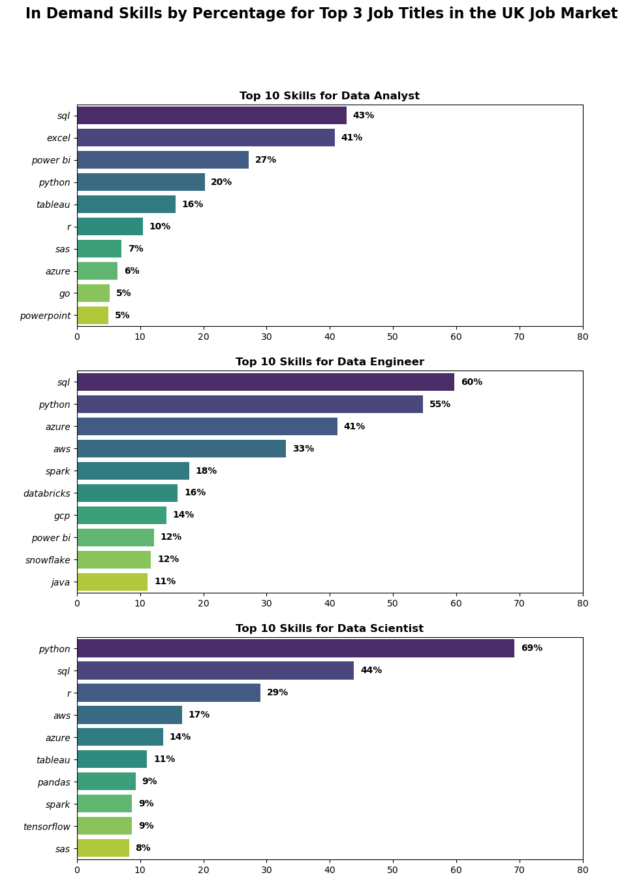

#The Analysis 

## What are the most in demand job skills for the top 3 most popular data jobs 

For this part I wanted to explore the skillsets that are most desired in the top data jobs. I observed the United Kingdom as it has a similar context to Australia!

For my analysis I utilised various tools. I created a new dataframe of the original that focused on the UK and specific job titles. Following this I highlighted the specific job skills and their counts for each job. Finally I visualised this data using seaborn. Although you can use matplotlib, I prefer seaborn due to its ease and aesthetics!

View my notebook for detailed steps here:  
[2.Skills_Count](2_ADVANCED/1_BASIC/3.Project/skills_count.ipynb)

## Visualise Data (seaborn)
```python
fig, ax = plt.subplots(len(job_titles), 1, figsize=(10, 15))

for i, job_title in enumerate(job_titles):
    subset = UK_skill_percentages[UK_skill_percentages['job_title_short'] == job_title]
    subset = subset.sort_values(by='skill_counts', ascending=False).head(10)
    #used seaborn for better visualization
    sns.barplot(data=subset, x='skill_percentage', y='job_skills', ax=ax[i], palette='viridis')
    ax[i].set_title(f'Top 10 Skills for {job_title}', weight='bold')
    ax[i].set_xlim(0, 80)
    ax[i].set_xlabel(' ')
    ax[i].set_ylabel(' ')
    ax[i].set_yticklabels(ax[i].get_yticklabels(), fontstyle='italic')
    plt.suptitle('In Demand Skills by Percentage for Top 3 Job Titles in the UK Job Market', fontsize=16, fontweight='bold')

    for n, v in enumerate(subset['skill_percentage']):
        ax[i].text(v + 1, n, f"{v:.0f}%", color='black', va='center', fontweight='bold')
```
## Results



### Insights 

1. In the UK, SQL 👾 and Python 🐍 are in high demand for all top data jobs.

2. Data Scientists place more emphasis on python, likely due to python's superior capability in drawing insights and various other coding techniques.

3. As pay goes up from data analyst, engineer and scientist, there is a greater demand for advanced coding skills such as python and R. 